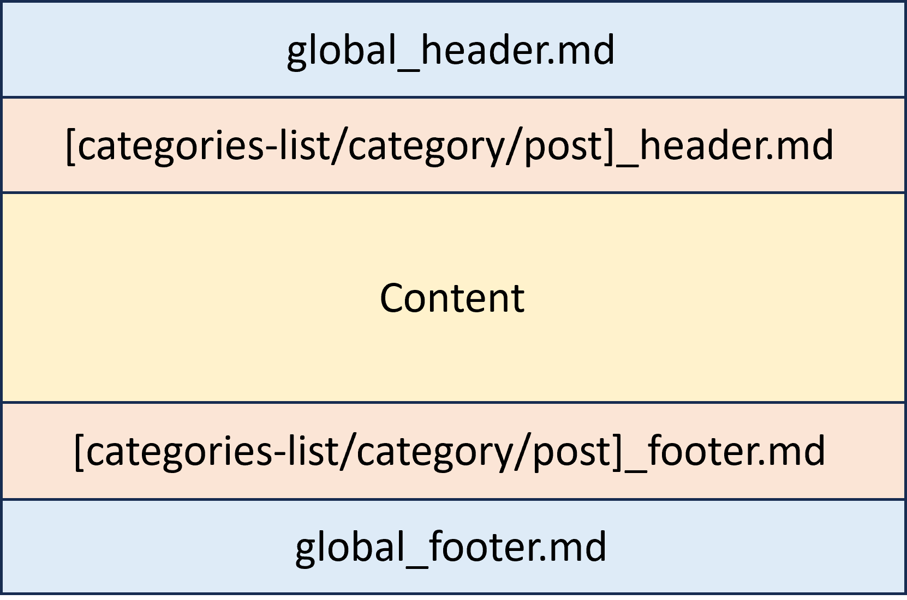

# Introdução

Uma das melhores maneiras de se manter motivado a continuar o processo de ser um desenvolvedor é documentando cada passo trilhado, ao fazer isso você se torna um farol para outros desenvolvedores, iluminando o caminho da aprendizagem em meio aos desafios da web. O `dev-dailybook` é mais do que uma ferramenta; é um refúgio onde sua jornada é realmente respeitada. Porém para iniciantes a internet se mostra um ambiente hostil, seja porque sempre aparece alguém com o único objetivo de desmotivar iniciantes contando seu progresso ou por causa de alguma arbitrariedade de administradores você pode ser penalizado sem fazer nada grave, mesmo projetos que surgem com o objetivo de acabar com esse mal acaba eventualmente se sucumbindo a ele, seja por má administração seja por atrair pessoas mal intecionadas, pensando nisso eu resolvi criar o `dev-dailybook`.

# O que é?

`dev-dailybook` nada mais é que um gerenciador de conteúdo, basicamente ele faz o mesmo que o fórums como HackerNews e TabNews fazem mas usando o GitHub Pages, uma vez configurado (e configurar é muito simples):

1. Abra uma Issue
2. Dê o título `setup`
3. Escolha uma `label` qualquer para disparar o `dev-dailybook`
4. Clique em `Submit new issue`

O `dev-dailybook` faz a mágica, atualiza uma lista com os 30 últimos posts, lista as `label` que possuem posts associados, cria uma lista com os post associados em cada `label` e claro, publica o post e ainda vai aparecer no Google. Então você pode documentar e compartilhar o seu conhecimento sem ter alguém te colocando pra baixo ou correr o risco de perder tudo por causa de alguma arbitragem de moderadores

# Configuração inicial

A primeira coisa a se fazer é criar um repositório do tipo GitHub Pages [(aqui está o guia oficial de como proceder)](https://docs.github.com/pt/pages) criado o repositório e [configurado a chave SSH (não pule essa etapa)](configurando-ssh.md), basta seguir os passos a seguir:

1. Copie o arquivo [`_build.sh`](_build.sh) para o seu repositório
2. Crie um arquivo no repositório com o nome `.github/workflows/dev-dailybook-action.yml` com o conteúdo do [`dev-dailybook-action.yml`](dev-dailybook-action.yml)
3. Crie uma `Issue` no seu repositório com o título `setup` com alguma label

E é só isso, aguarde alguns instantes e o repositório será configurado automaticamente, siga o painel no `README.md`

# Configuração avançada

### Título da página (recomendado)

Edite o arquivo `_config.yml` e troque `My awesome website` pelo título desejado

### Quantidade de posts listados no link `/recents` (opcional)

Por padrão são listados os últimos 30 posts, para alterar edite o `_config.yml` e na linha troque `recents_count:` troque 30 pelo valor desejado

### Os cabeçalhos e rodapés (recomendado)

Dentro da pasta `_special` você encontrá os cabeçalhos (terminados em `_header.md`) e rodapés (terminados em `_footer.md`) de todas as páginas, veja a relação:

- `global`, afeta todas as páginas
- `categories-list`, afeta a pagina que lista as categorias
- `category`, afeta todas as paginas do tipo categoria
- `recents`, afeta a pagina que lista os posts recentes
- `post`, afeta todos os posts

Esse é o modelo:

> **Nota:** os arquivos `categories-list_header.md`, `category_header.md` e `recents_header.md` devem manter a estrutura da tabela ao final do arquivo

### Erro 404 (opcional)

Edite o arquivo `_404.md` e coloque a mensagem que desejar

# Limitações conhecidas

1. Posts e categorias iniciados com `_` não são publicados no GH Pages
2. Não é possível usar ", ', |, # ou : diretamente no título da página use `&quot;`, `&apos;`, e `&#58;` respectivamente
3. Não é possível usar / e # no título

# Endpoints especiais

- `/recents` página com os últimos posts
- `/categories` página com os últimos posts

# Dicas e recursos:

* Adicionar uma linha com o nome de uma categoria entre chaves fará a categoria ser adicionada no local, exemplo: `{@Minha categoria}`

